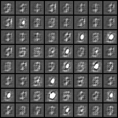

# generative_zoo

generative_zoo is a repository that provides working implementations of some generative models in [PyTorch](https://pytorch.org). 

#### Available Implementations

| Name of Generative Model | Brief Description | References (if any) |
| ------------------------ | ----------------- | ------------------- |
| Multilayer Perceptron GAN (MLPGAN) | Generative Adversarial Network with MLP Generator Network and Discriminator Network | [Ian Goodfellow et al.](https://arxiv.org/abs/1406.2661) |
| Deep Convolutional GAN (DCGAN) | Generative Adversarial Network with Deep Convolutional Generator and Discriminator Network | [Alec Radford et al.](https://arxiv.org/abs/1511.06434) |
| Variational Autoencoder (VAE) | Better performing Autoencoder with a single layer Encoder and Decoder Network | [Kingma et al.](https://arxiv.org/abs/1312.6114) |
| Wasserstein GAN (WGAN) | Generative Adversarial Network with a different method of training | [Martin Arjovsky et al.](https://arxiv.org/abs/1701.07875) |
| &#945; GAN | Generative Adversarial Network combined with an Auto-Encoder and a different training strategy | [Mihaela Rosca and Balaji Lakshminarayanan et al.](https://arxiv.org/abs/1706.04987) |

### Broken Implementations

+ The code for VAEGAN does not generate good images. If you would like to contribute to the repo, please help solve this [issue](https://github.com/DL-IT/generative_zoo/issues/1). Thanks!!
+ The code for Improved WGAN provides bad images and the training is extremely unstable. If you would like to contribute to the repo, please help solve this [issue](https://github.com/DL-IT/generative_zoo/issues/4). Thanks!!

### Datasets

| Name of Dataset | Brief Description | References (if any) |
| --------------- | ----------------- | ------------------- |
| MNIST | Digit Recognition dataset | [Yann LeCun et al.](http://yann.lecun.com/exdb/mnist/) |
| CIFAR10 | Color Image Recoginition dataset | [Alex Krizhevsky](https://www.cs.toronto.edu/~kriz/learning-features-2009-TR.pdf) |
| LSUN | Large Scene Understanding | [Fisher Yu et al.](http://lsun.cs.princeton.edu/) |
| CUB200 | Birds Dataset | [Wellinder et al.](https://http://www.vision.caltech.edu/visipedia/CUB-200.html) |
| FASHION-MNIST | Clothes dataset with similar characteristics as MNIST | [Zalando Research](https://github.com/zalandoresearch/fashion-mnist) 

### Requirements

+ **Python 3.x**
+ **PyTorch 0.2 or better** (If you want to test other models except Improved WGAN : then you can use **PyTorch 0.10 or better**)
+ **Torchvision**

### File Structure

+ `Architectures` contains dataset specific architectures (currently only for MNIST and CIFAR10) and a Generic Architecture generator
+ `Modules` contains the key modules of the GANs
+ `Mains` contains the sample Main files written for the GANs
+ `Utilities` contains some utility files and CUB200 and FASHION-MNIST dataset loaders
+ `Examples` contain some GIFs that show the variation in the improving quality of generated images with time

### Usage of the implementations

+ Clone this repository using
```bash
git clone https://github.com/DL-IT/generative_zoo.git
```

+ From the directory you have cloned into, you will be able to use the code. Just perform
```python
import generative_zoo
```

+ There are multiple submodules such as `Architectures`, `Modules` and `Utilities`. 
    + In `Architectures`, you can take a data-specific architecture for `MNIST` and `CIFAR10` and a generic architecture which can be used for any square image in general. You need to use it using the below code:
    ```python
    generator = generative_zoo.Architectures.<name>.Generator(*args)
    discriminator = generative_zoo.Architectures.<name>.Discriminator(*args)
    ```

    Here `<name>` can be `CIFAR10`, `MNIST` or `Generic`.

    + In `Modules`, you can take specific types of GANs which are listed above. This can be invoked using 
    ```python
    my_GAN = generative_zoo.Modules.<name>(*args)
    ```
    Here `<name>` can be any one of the above GAN types.

    + In `Utilities`, you can have some basic utilities and dataset providers. Especially, `data_utilities` inside `Utilities` provides data of required size and certain other specifications.

+ In addition to all this, there are sample main files to give you an idea as to how the code works in all, available in `Mains`. This has to be accessed externally.

#### Some generations
| MNIST | CIFAR10 |
|-------|---------|
|||
